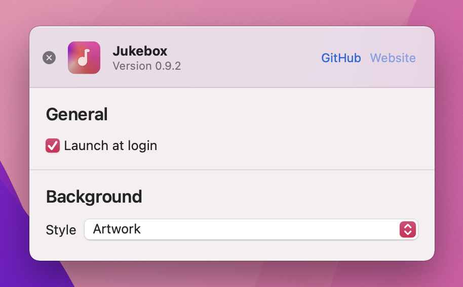

  

## About
Jukebox is a macOS application that allows you to display and control the currently playing song from Spotify in the menu bar.

*(Apple Music support will come soon)*

**Jukebox requires macOS 11 Big Sur or greater.**

## Install

## Usage

  

The app shows the currently playing song in the menu bar. Clicking the menu bar item will present a window displaying details of the current track. Hovering over the album art gives you controls.

  

The background that appears behind the album art can be changed in preferences.

## Attributions
- This project uses [Sparkle](https://sparkle-project.org) for update delivery
- This project makes use of [LaunchAtLogin](https://github.com/sindresorhus/LaunchAtLogin)
